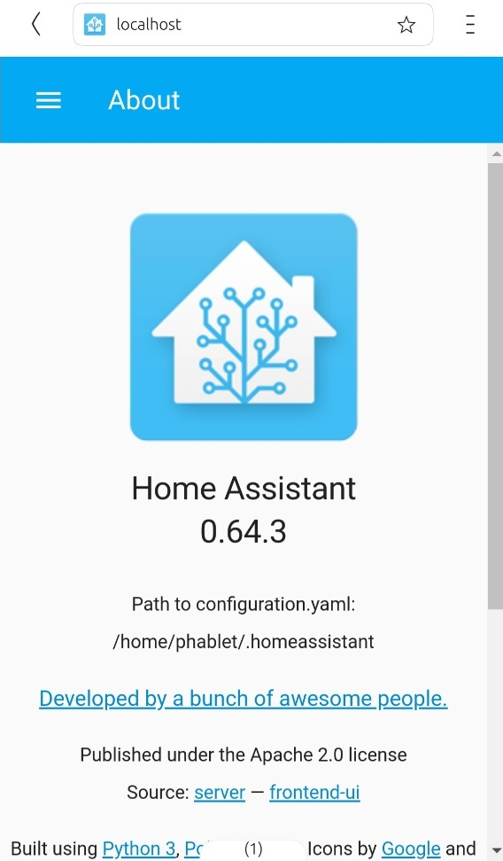

# Home Assistant on Nexus 5

Install Ubuntu Touch
--------------------
On a linux desktop get the UBports installer:

`user@ubuntu-desktop$ snap install ubports-installer`  
... and then run it  
`user@ubuntu-desktop$ ubports-installer`  
See [alternative methods](https://github.com/ubports/ubports-installer/) if snap is not an option.

Once UT is running on the device, go in Settings => About and activate Developer Mode. You will need to set a passcode for Developer Mode

From the desktop connect through adb or ssh to the device:  
`user@ubuntu-desktop$ adb shell`  

Create a container
------------------
`phablet@ubuntu-phablet:~$ libertine-container-manager create -i hass`  

Install dependencies
------------
`phablet@ubuntu-phablet:~$ libertine-container-manager exec -i hass -c bash`  
`root@ubuntu-phablet:/# apt-get install python3-dev python3-pip python3-venv`  

Install Home Assistant
---------------
`root@ubuntu-phablet:/# python3 -m venv homeassistant`
`root@ubuntu-phablet:/# cd homeassistant`
`root@ubuntu-phablet:/# source bin/activate`
`root@ubuntu-phablet:/# python3 -m pip install homeassistant==0.64.3`

Start Home Assistant

Still in the virtual environment run:  
`root@ubuntu-phablet:/# hass`
First run will take 10-15 minutes.
Point the Nexus 5 browser to:  
`http://localhost:8123`

Configuration files are stored in /home/phablet/.cache/libertine-container/hass/rootfs/home/phablet/.homeassistant/.
To use scp (or WinSCP) to access this folder from the desktop, configure ssh:  
`user@ubuntu-desktop$ ssh-keygen`  
`user@ubuntu-desktop$ adb push ~/.ssh/id_rsa.pub /home/phablet/`  
`user@ubuntu-desktop$ adb shell`  
`phablet@ubuntu-phablet:~$ mkdir /home/phablet/.ssh`  
`phablet@ubuntu-phablet:~$ chmod 700 /home/phablet/.ssh`  
`phablet@ubuntu-phablet:~$ cat /home/phablet/id_rsa.pub >> /home/phablet/.ssh/authorized_keys`  
`phablet@ubuntu-phablet:~$ chmod 600 /home/phablet/.ssh/authorized_keys`  
`phablet@ubuntu-phablet:~$ chown -R phablet.phablet /home/phablet/.ssh`  
`phablet@ubuntu-phablet:~$ sudo android-gadget-service enable ssh`
`user@ubuntu-desktop$ ssh phablet@ubuntu-phablet`  

